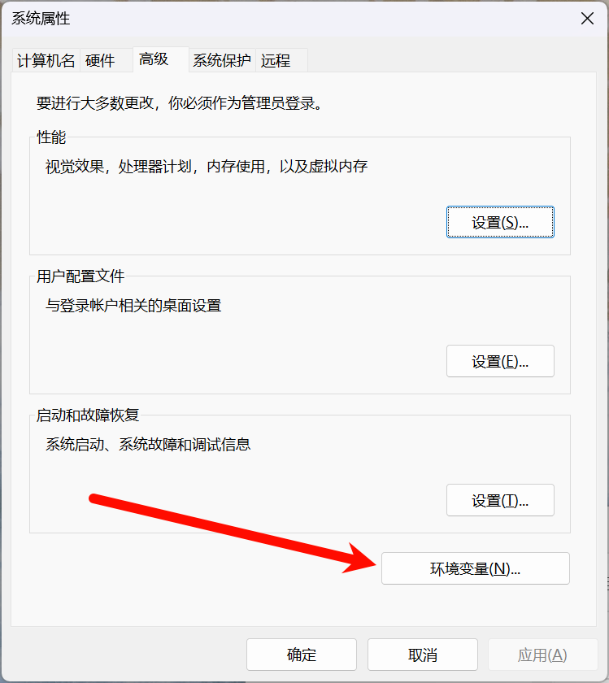

# CMake Install

## 安装编译器

如果你已经安装过了较新版本的编译器，如 Visual Studio 2022 及以上、GCC 13 及以上或者 Clang 15 及以上，则可以跳过这个部分。

在这个部分中，我们将会涉及到各个平台下的编译器的安装，你只需要根据你所使用的电脑的操作系统，选择阅读相应的部分即可。

### Windows

在 Windows 下，一般有两种主流的编译器选项：由 Microsoft 公司开发的 MSVC 编译器和 GNU 计划下的 GCC 编译器。

其中，MSVC 编译器跟随着微软的生成工具一同发行。MSVC 编译器是 Windows 操作系统的首选编译器，对 Windows 操作系统的各项功能和 API 支持最好。

#### MSVC 编译器

如果你安装了 Visual Studio 这个 IDE，那么 msvc 会自动跟随下载，无需进行额外步骤；如果你不想使用 Visual Studio，但同时还想使用微软的生成工具，你可以在[Microsoft C++ 生成工具 - Visual Studio](https://visualstudio.microsoft.com/zh-hans/visual-cpp-build-tools/)处点击”下载生成工具“来下载。

#### GCC 编译器

[MinGW-W64-binaries](https://github.com/niXman/mingw-builds-binaries/)仓库提供了 MinGW-W64 的预编译版本，你可以在 releases 界面下载到编译好的 MinGW-W64 包。

如果你不知道如何从众多的版本中选择，你可以直接下载[这个版本](https://github.com/niXman/mingw-builds-binaries/releases/download/13.2.0-rt_v11-rev1/x86_64-13.2.0-release-posix-seh-ucrt-rt_v11-rev1.7z)。

下载好之后会得到一个压缩包，请将压缩包解压到一个你喜欢的位置（路径中请不要包括中文字符等非 ASCII 字符，以免引发不必要的异常）。然后，打开刚刚解压好的文件夹，进入其中的`bin`子目录，复制这个目录的路径（形如`X:\xxx\xxx\mingw64\bin`）。

然后，我们需要将这个路径添加到系统环境变量的 PATH 变量中，以方便后续在命令行中使用。

> 什么是 PATH 变量？
>
> 它用于指定系统在哪些目录中搜索可执行文件。当你在命令提示符（CMD）、Powershell 或运行对话框中输入一个命令时，Windows 会根据 PATH 变量中指定的路径顺序来搜索这些可执行文件。
> 如果命令所对应的可执行文件存在于 PATH 指定的任何一个路径中，系统就会执行该可执行文件。
>
> PATH 变量也会被其他很多程序识别并使用。

- 步骤 0：按下`Win`键，在 Windows 的搜索框中搜索**编辑系统环境变量**并进入。
  

- 步骤 1: 点击**环境变量**，进入修改环境变量的界面。
  

- 步骤 2：在**系统变量**中找到名为**PATH**的变量，左键选择它并点击下面的**编辑**按钮。
  

- 步骤 3：点击**新建**按钮，粘贴我们刚才复制的形如`X:\xxx\xxx\mingw64\bin`的目录路径（图中是`D:\Program Files\mingw64\bin`），并**务必**点击**确定**按钮保存，并且，上一个页面（步骤 2 中页面）也**必须**点击**确定**保存。

  **必须点击确定按钮！**
  **必须点击确定按钮！**
  **必须点击确定按钮！**

  **上一个页面的确定按钮也要点！**
  **上一个页面的确定按钮也要点！**
  **上一个页面的确定按钮也要点！**

  

- 步骤 4：启动一个新的终端（如果你之前已经启动了终端，请**完全关闭**再重新打开），输入`gcc --version`命令，检查是否成功安装（参考下方图片中的输出）。如果提示*未找到命令*等，你可以尝试重启电脑。
  

### MacOS

MacOS 下，我们推荐使用 Apple 官方提供的**Apple Clang**编译器，它是 Clang 编译器的修改版。

你只需要简单地在**终端**中运行以下命令，并且按照指引操作，就可以成功安装。

```bash
xcode-select --install
```

### Linux (Ubuntu)

我们只提供 Ubuntu 发行版的安装教程，如果你使用的是 debian 发行版，那么这个也是通用的。

如果你使用的是其他发行版，我们默认你有解决环境配置问题的能力，如果你遇到了困难，欢迎随时咨询助教。

Linux 上推荐使用 GCC 编译器。在 Ubuntu 发行版中，安装 GCC 编译器非常简单，只需要在命令行中执行以下命令即可。

```bash
sudo apt update && sudo apt install -y build-essential
```

## 安装 CMake

CMake 是一个跨平台的开源构建系统，它采用了一种与平台无关的配置文件来控制软件的编译过程。通过使用简单的配置文件（CMakeLists.txt），开发者可以描述项目的组织结构、依赖关系以及编译选项，而不需要直接处理特定于操作系统或编译器的细节。

### Windows

你可以在以下链接中下载到 CMake 的安装包，注意，请下载`Windows x64 Installer`所对应的链接。

[CMake 下载地址](https://cmake.org/download/#latest)

下载完成直接运行安装包安装即可。但值得注意的是，安装过程中请选择“**Add CMake to system PATH for all users**”，这十分重要！


安装成功之后，启动一个新的终端（如果你之前已经打开了终端，请**完全关闭**后再重新启动），运行`cmake --version`以检查是否成功安装。如果报*未找到程序*等错误，可以尝试重启电脑。


### MacOS

你可以在以下链接中下载到 CMake 的安装包，注意，请根据你的 MacOS 版本下载后缀名为`.dmg`的安装包。

[CMake 下载地址](https://cmake.org/download/#latest)

下载完成之后安装即可。安装完成后在终端中运行以下命令为程序创建软链接（需要输入用户密码），以方便在命令行中的使用。

```bash
sudo "/Applications/CMake.app/Contents/bin/cmake-gui" --install
```


可以运行`cmake --version`来检查是否安装成功。


### Linux (Ubuntu)

在命令行中运行以下命令即可安装。

```bash
sudo apt update && sudo apt install -y cmake
```

然后通过以下命令检查是否安装成功。

```bash
cmake --version
```

## 构建你的第一个 CMake 项目

创建一个空文件夹，然后在该文件夹中创建以下两个文件并写入相应的内容。

- **main.cpp**

  ```cpp
  #include <iostream>
  #include <format>

  int main() {
    std::cout << std::format("Hello, {}!\n", "World");
  }
  ```

- **CMakeLists.txt**

  ```cmake
  # 指定此项目所需的 cmake 的最低版本
  cmake_minimum_required(VERSION 3.10)
  
  # 项目名称
  project(HelloWorld)
  
  # 添加一个可执行文件目标
  # add_executable(可执行文件名 源文件列表)
  add_executable(HelloWorld main.cpp)

  # 设置此目标的 C++ 标准
  set_target_properties(
    HelloWorld
    PROPERTIES CXX_STANDARD          20
               CXX_STANDARD_REQUIRED ON)
  ```

然后打开终端，定位到该文件夹，运行以下命令编译程序，以下命令对 Windows（包括 Powershell 和 CMD）、MacOS、Linux 均通用。

```bash
mkdir build
cmake -B build
cmake --build build
```

- 第一行命令为创建一个命为`build`的文件夹，之后步骤中的 CMake 临时文件、生成的二进制文件都会存放在这里。

- 第二行命令为在 `build` 中生成 CMake 临时文件，运行这个命令的时候，CMake 会自动探测当前的编译器环境，并生成对应的构建命令。

  如果你是 Windows 用户，且之前决定使用 MinGW 编译器，需改用 `cmake -B build -G "MinGW Makefiles"`。

- 第三行为编译程序。

  `cmake --build`命令需要接受一个包含有 CMake 临时文件的文件夹作为参数，我们指定为`build`文件夹，即为存放 CMake 临时文件的目录。

之后，我们可以运行刚刚编译好的程序。

- 如果你是 MacOS、Linux 系统，或者在 Windows 系统下使用 GCC 编译器，那么程序将会被生成到`build`文件夹的根目录中。（因为都是使用的 make 或者 ninja 生成器）

  直接运行`./build/HelloWorld`（MacOS 和 Linux）或者`.\build\HelloWorld.exe`（Windows）即可看到输出。

  

- 如果你是使用 Windows 系统下的 MSVC 编译器，那么程序被存放的路径将会复杂一点，你可以在`build`文件夹下的`Debug`目录中找到生成的程序。

  运行`.\build\Debug\HelloWorld.exe`即可看到输出。

  
