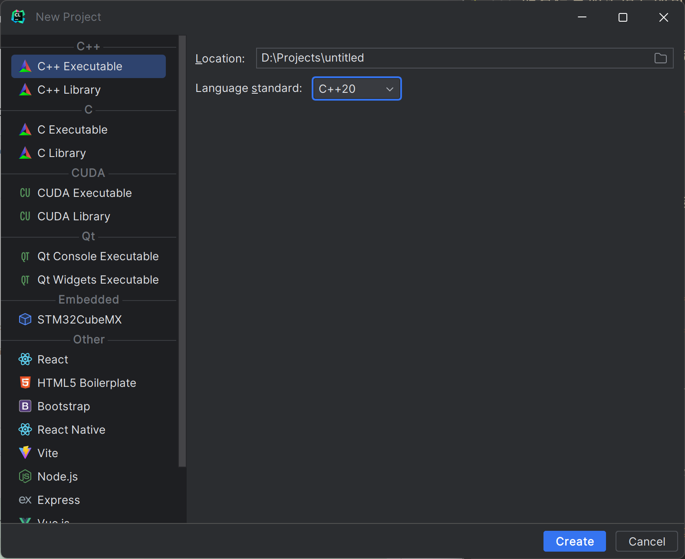

# 如何配合IDE使用CMake

CMake作为一个广泛使用的构建工具，被各种IDE非常好地支持，在IDE中直接使用并不是难事。这样，你就可以利用IDE已经提供好的各种工具，例如调试器（debugger）等，进行除了生成程序外的功能。当CMakeLists更新时，IDE会自动进行合适的调整来构建目标。

## Visual Studio

### 已有CMakeLists

点击VS，点击“打开本地文件夹”，打开含有CMakeLists.txt的文件夹即可。

### 创建CMake工程

你也可以像创建空项目一样，用Visual Studio创建一个CMake工程：

点击“CMake项目”即可，VS已经生成了一个较为复杂的CMake模板，暂时只需要改动或增加`add_executable`的部分即可。

## CLion

### 已有CMakeLists

点击Open，打开含有CMakeLists.txt的文件夹即可。

### 创建CMake工程

CLion默认使用的管理工具就是CMake，所以点击“New Project”，把语言标准调整为`C++20`即可。

## VSCode

VSCode本身只是编辑器，因此建议安装Microsoft C/C++来提供基本的C/C++代码补全及相关功能，并安装CMake和CMake Tools两个插件以获得CMake的良好支持。注意把CMake Tools插件中的设置中的“status bar visibility"改为"compact"，如下：

这时下方的状态栏就会出现CMake相关的图标，点击"Kit"的选项选择工具链；如果你已经安装了Visual Studio，选择`-amd64`那个即可使用`msvc`；如果你想使用MinGW，请选择MinGW的那个选项。

> - 在以前的版本中，使用VS的toolkit可能需要使用管理员模式启动VSCode来成功构建；助教在最新版的VSCode和VS2022中未发现此问题。
> - MinGW可能不支持非ascii码路径（即不支持中文路径）。

随后就可以点击齿轮进行编译，点击`▶`符号进行运行，虫子的符号进行debug。你可以把`Debug`换为`Release`得到优化版本。如果你需要更多的可执行程序，就再加其他的`add_executable`即可。