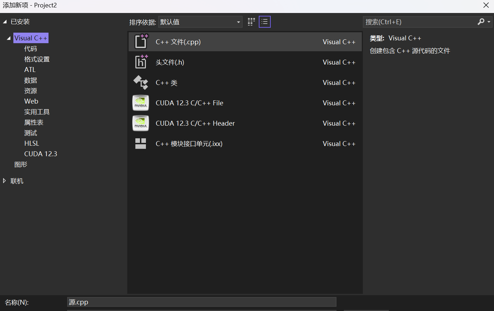
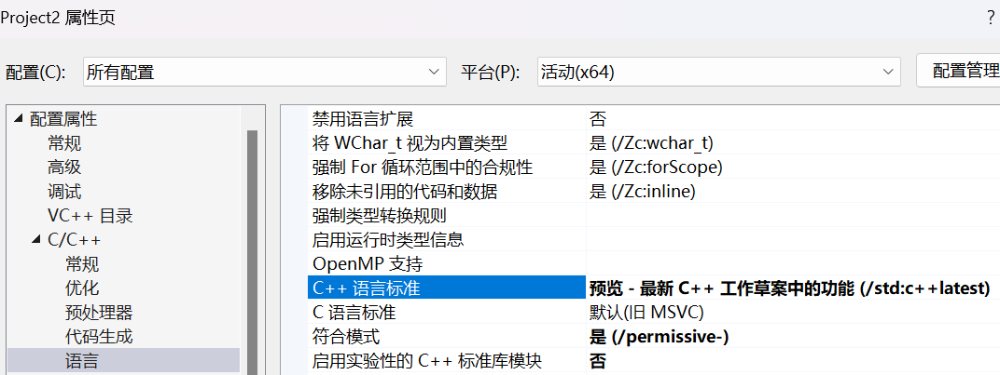
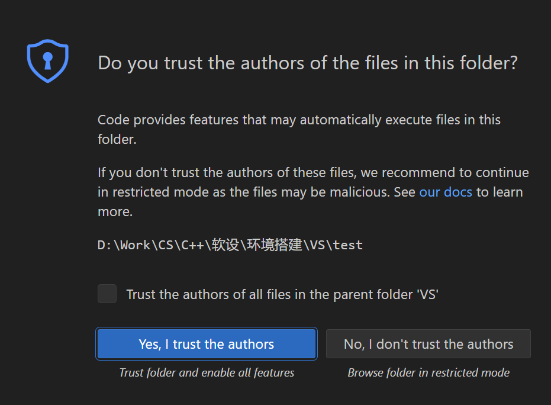
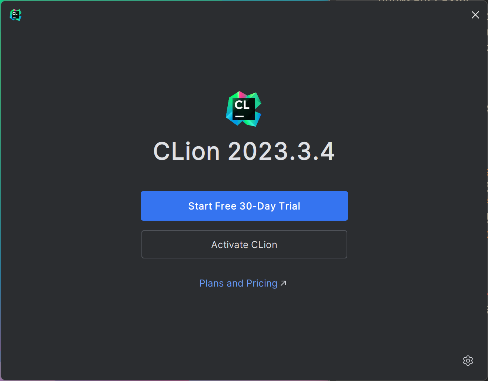
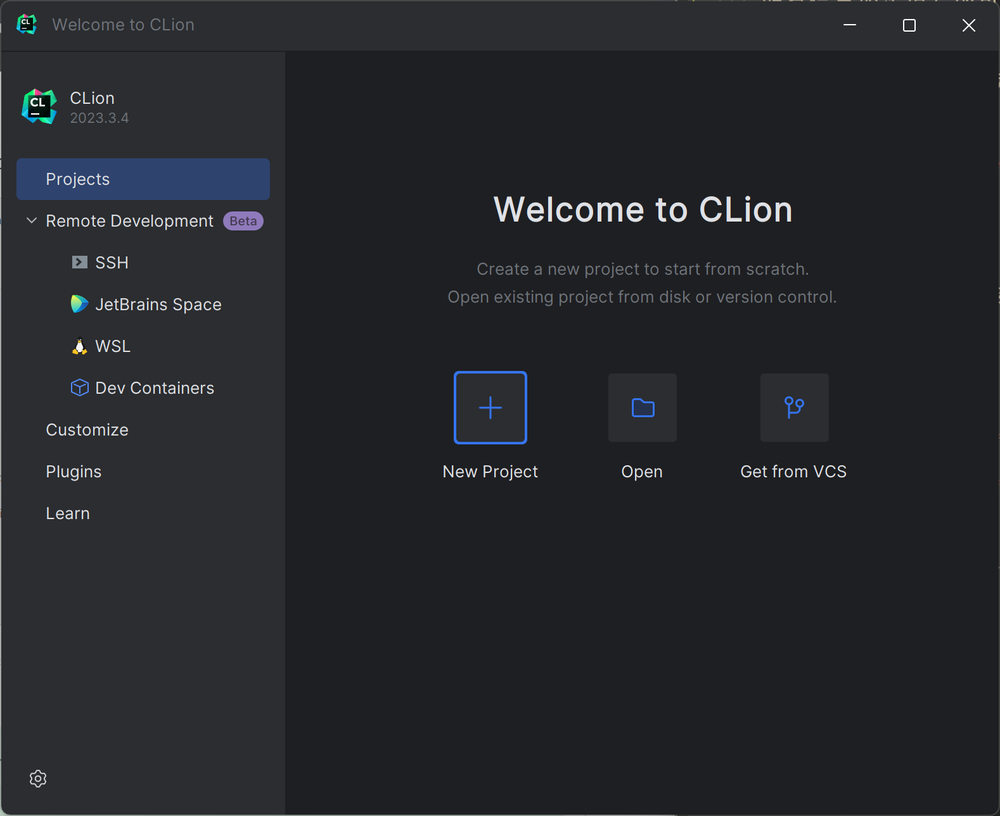

# 总览

程序员的开发环境一般分为以下部分：

+ 所在操作系统，就是你的电脑当前是什么操作系统，例如Windows11，Ubuntu20.04（可以认为是Linux的一种）等。

+ 目标操作系统，就是开发的程序将要在什么操作系统上运行，最简单的就是在什么操作系统上生成，就在什么操作系统上执行，在计算概论中大家就是这样的。

+ 编译器：能够将源代码在所在操作系统编译为目标操作系统上的可执行程序的软件。

  > 同时，为了更方便地指定哪些代码以哪些选项生成哪些可执行程序，在较大型的工程中，程序员会使用“构建工具”（Build tools）来辅助这一过程；CMake、XMake等就是这一工具。

+ 编辑器：能够方便地把各种代码文件组织起来，提供一定的编辑功能，并允许通过插件进行扩展的软件。

+ 各种相关开发工具，包括性能探测器、debugger等等。

一个IDE（Integrated development environment，集成开发环境）集合了除目标操作系统外的所有软件，并允许插件扩展，适合大型工程的开发和新手的入门。除此之外，我们也可以逐个组装，获得自己想要的环境。

在Windows上，通常你有以下的选项：

+ Visual Studio；这是一款IDE，所在操作系统为Windows，编译器为msvc，编辑器为VS自带编辑器，自动包含各种相关开发工具；目标操作系统为Windows，但是通过虚拟环境或者服务器，也支持Linux目标操作系统。

+ CLion；这是一款由JetBrains公司开发的专门用于C和C++开发的跨平台IDE。
主要通过clangd和clang-format等工具提供代码补全、格式化、调试等功能，并支持多种编译器。
Clion是一款收费软件，但提供了教育免费版，所以可以使用学校邮箱认证后免费使用正版的Clion。

+ MinGW；这是一个工具链，所在操作系统为Windows，编译器为gcc，包含少量相关开发工具；目标操作/系统为Windows，**需要用户自己提供编辑器**。

+ VSCode：这是一个编辑器，既可以配合MinGW使用（从而可以使用g++编译器），也可以在已经安装Visual Studio的平台上使用（从而可以使用msvc编译器）。

  > 还有很多其他的编辑器，例如Sublime等，这里就不介绍了。

+ WSL/docker/其他虚拟机/服务器：提供目标操作系统，例如Linux和Mac。不同的虚拟机所能提供的功能不同，例如WSL、docker以及服务器一般只能提供编译器和开发工具，不方便在其上直接运行较大的编辑器，而是需要本地运行编辑器并与他们进行连接（例如使用VSCode、Visual Studio等）；而另一些功能强大的虚拟机就类似于“另一台电脑”，可以在上面安装任何的软件，此时所在操作系统可以不是本机系统，而是虚拟机提供的系统，在其上进行完全的开发。

  > 我们这门课不需要虚拟机，即所在操作系统和目标操作系统一致，因此以上虚拟环境暂时不属于我们的讨论范围。

按照我们的说法，你可以进行任意组合，例如：

+ 仅使用Visual Studio。
+ 安装VS，并安装VSCode，从而可以在VSCode上使用msvc，哪个方便使用哪个（毕竟有时VS还是太笨重）。
+ 安装MinGW+VSCode，从而在VSCode上使用gcc。
+ 想换一个目标操作系统，那么可以使用WSL+VSCode或者docker+VSCode，在虚拟环境上安装gcc工具链，并在VSCode上安装相关插件即可。
+ 想使用更强大的虚拟机，可以安装Virtual Box等，在上面直接安装VSCode，仿佛在Linux上开发，此时你不应该再参考Windows环境安装。
+ ...

## Visual Studio

请现在[Visual Studio官网](https://visualstudio.microsoft.com/)下载VS社区版，并在安装时勾选“使用C++的桌面开发”。如果你已经下载了，可以随时在Visual Studio Installer中进行更新（在下面任务栏中搜索即可）。

> 如果VS的更新非常慢，与正常网速严重不匹配，可以在[download.visualstudio.microsoft.com - dns查询--站长工具 (chinaz.com)](https://tool.chinaz.com/dns/download.visualstudio.microsoft.com)中找到TTL值最小的IP地址，并在`C:\Windows\System32\drivers\etc`中的`hosts`文件（请用管理员模式打开）的最后一行加上`在网站中找到的地址 download.visualstudio.microsoft.com`即可。

Visual Studio是一款强大的IDE，具有复杂工程开发中必备的各种工具，也比较适合新手入门使用。下载VS后，会自动下载微软的C++编译器msvc。Windows上的开发一般适合使用msvc的工具链。

### 一般工程

点击“创建新项目”，找到“空项目”，点击创建即可：


进入工程后（VS称之为“解决方案”，solution），在右侧边栏的“解决方案资源管理器”中找到“源文件”，右键点击，并点击“新建项”（你也可以直接使用快捷键Ctrl+Shift+A），选择“C++文件”，并在下方修改名称即可。



随后，你就可以编写C++代码了；编写完成后，可以按Ctrl+F5进行编译并运行，也可以按Ctrl+B只编译不运行；如果想进行Debug，就在相应的代码行的左侧点击加上断点，并按F5进行debug。


特别地，VS默认有两个模式，即Debug和Release模式，它们对应了不同的编译器选项，Debug模式允许你进行debug，release模式则开启了大量的优化选项，代码通常不直接按照你写的顺序执行，无法进行debug。

你可以在顶部的`项目`中找到`属性`，并设置工程选项；我们的课程要求使用C++20，所以请在其中的`C/C++ -> 语言`中的`C++语言标准`至少启用C++20。注意，你可以在配置和平台处选择“所有配置”来为Debug和Release启用相同的选项。



### CMake工程

类似地，可以在创建新项目时选择"CMake项目"，随后在相应的文件夹下创建文件等即可，并编写CMakeLists.txt；每次保存CMakeLists.txt后，如果格式正确，VS会自动根据target把代码文件包括进解决方案资源。

如果你已经有一个并非VS创建的CMake工程（例如从github中下载下来的），可以不点击“创建新项目”，而是点击“打开本地文件夹”，VS也会自动识别CMakeLists.txt来生成相应的解决方案。

> CMake本身也可以在Windows平台上生成解决方案，供VS打开使用。

### 命令行

在下载Visual Studio后，你也可以在命令行中使用msvc编译器。在任务栏中搜索“x64 Native Tools Command Prompt for VS”（一般输入x64 Native就够了），即可打开已经为msvc初始化好的命令行（普通的terminal是不能像gcc一样直接用msvc编译器的）。随后输入`cl /EHsc 代码文件 /Fe可执行文件保存路径`即可，例如`cl /EHsc a.cpp /Fetest`，即会生成`test.exe`。

> VS中直接按Ctrl+`（即电脑左上角的按键，和波浪线同一按钮）也可以使用命令行。

你可以看[微软的官方文档](https://learn.microsoft.com/en-us/cpp/build/reference/compiler-options-listed-by-category)来了解更多的编译器选项，**不过一般情况下不建议在windows中直接使用命令行**。

## MinGW

MinGW，全称Minimal GNU for Windows，用于在Windows上使用gcc工具链。虽然一般情况下推荐使用微软自己的工具链，但是它确实存在一些问题：

+ 如果你写的一些代码不符合C++标准，例如出现了仅gcc编译器支持的“方言”，那么在Windows上使用msvc编译器和在Linux上使用g++编译器可能导致不同的行为（甚至换用编译器可能编译不过）；
+ 如果你的工作要求使用全开源工具链（<del>或者你痛恨微软作恶太多，包括对msvc编译器不开源</del>），MinGW和gcc都是开源的；
+ ...

目前MinGW本体已经停止维护，应该在它之上的分支MinGW-w64。我们一般下载集成了MinGW-w64的工具链，比较建议大家使用MSYS2；请参考[MSYS2官网](https://www.msys2.org/)进行安装。特别地，如果由于网络原因无法下载installer，可以使用以下镜像（请下载其中的那个纯`.exe`文件）：

- 清华镜像：[https://mirrors.tuna.tsinghua.edu.cn/msys2/distrib/x86_64](https://link.zhihu.com/?target=https%3A//mirrors.tuna.tsinghua.edu.cn/msys2/distrib/x86_64)
- 科大镜像：[https://mirrors.ustc.edu.cn/msys2/distrib](https://link.zhihu.com/?target=https%3A//mirrors.ustc.edu.cn/msys2/distrib/)
- github镜像：https://hub.nuaa.cf/msys2/msys2-installer/releases

## VSCode

这是一款纯编辑器，首先在[VS Code官网](https://code.visualstudio.com/)下载VS Code，并需要安装下面的插件之一来提供一定的开发工具：

1. 下载Microsoft C/C++ Extension：

   

2. 

我们比较建议使用CMake或者XMake这种构建工具来组织代码，进行各种配置比较方便。如果你想使用无构建工具辅助的组织形式，我们也在最后给了一个例子。

用VSCode打开一个文件夹后，会出现如下的提示：



我们自己创建的文件夹都是安全的，所以选择"Yes"即可；如果你从互联网上下载，并且它很有可能对你的环境进行恶意的攻击，那么可以选择"No"。这门课就全选Yes就行了（

## CMake

我们建议安装CMake和CMake Tools两个插件，并同时安装CMake本身。如果你已经安装了Visual Studio，它在`VS路径\Common7\IDE\CommonExtensions\Microsoft\CMake\CMake\bin`中就已经安装了CMake软件（不过微软可能进行了一些改造）；除此之外，你也可以自己在[CMake官网]([Download CMake](https://cmake.org/download/))安装标准的CMake，在相应的路径就可以找到。

随后，你有两种选择：

+ 在环境变量中加入该路径（在任务栏搜索“编辑系统环境变量”，点击下方“环境变量”，在用户变量或系统变量的`Path`变量处添加上CMake路径即可）。这样，你在命令行中也可以直接使用CMake。

  > 请关闭VSCode，随后重新打开以使新的环境变量在VSCode中生效。

+ 改变cmake-tools插件中的设置（插件右下角的齿轮），把CMake path（搜索path就能找到）改为该路径。

然后在文件夹中创建`CMakeLists.txt`，如下：

```cmake
cmake_minimum_required(VERSION 3.28) # cmake最小版本
project(demo) # 项目名称

set(CMAKE_CXX_STANDARD 20) # 设置C++版本，至少是20。
add_executable(a a.cpp) # a是可执行文件的名字，a.cpp是用于构建的代码文件
```

此外，应当把cmake-tools插件中的设置中的“status bar visibility"改为"compact"，这时下方的状态栏就会出现CMake相关的图标，点击"Kit"的选项选择工具链；如果你已经安装了Visual Studio，选择`-amd64`那个即可使用`msvc`；如果你想使用MinGW，请选择MinGW的那个选项。

> + 在以前的版本中，使用VS的toolkit可能需要使用管理员模式启动VSCode来成功构建；助教在最新版的VSCode和VS2022中未发现此问题。
> + MinGW可能不支持非ascii码路径（即不支持中文路径）。

随后就可以点击齿轮进行编译，点击`▶`符号进行运行，虫子的符号进行debug。你可以把`Debug`换为`Release`得到优化版本。如果你需要更多的可执行程序，就再加其他的`add_executable`即可。

## XMake

XMake是由中国工程师开发的开源构建工具，使用lua语言编写脚本（相比于CMakeLists可读性更高些），并集成了包管理工具xrepo，解决了很多CMake本身的痛点问题。不过它目前的普适程度还比不上CMake（虽然可以自动生成CMakeLists），所以仅供有兴趣的同学使用。

如果你想使用XMake，你可以安装插件XMake，并安装XMake本身（详见[安装 - xmake](https://xmake.io/#/zh-cn/guide/installation)）。在Windows中用Installer安装时注意勾选”添加到环境变量PATH“中。

随后编写`xmake.lua`：

```lua
set_xmakever("2.8.6") -- xmake最小版本
set_project("demo") -- 项目名称

set_languages("cxx20") -- 设置C++版本，至少是20
target("a") -- 可执行文件的名字
    add_files("a.cpp") -- 用于构建的代码文件
```

然后保存，就会在`.vscode`下自动生成`compile_commands.json`文件。这个文件生成与否不会影响构建，只会影响代码补全等功能。在下面任务栏就可以选择构建选项，`release`可以换为`debug`，`toolchain`可以换为mingw（Windows在装了VS的情况下默认为msvc），其余符号与CMake插件一致。

随后，为了能让Microsoft C/C++正确发挥作用，还需要在`.vscode`中编写`c_cpp_properties.json`，如下：

```json
{
    "configurations": [
        {
            "name": "Win32",
            "includePath": [
                "${workspaceFolder}/**",
                "D:\\Softwares\\Visual Studio\\VC\\Tools\\MSVC\\**",
            ],
            "defines": [
                "_DEBUG",
                "UNICODE",
                "_UNICODE"
            ],
            "compileCommands": ".vscode/compile_commands.json",
            "intelliSenseMode": "windows-msvc-x64",
            "cppStandard": "c++20"
        }
    ],
    "version": 4
}
```

就可以正常进行代码提示了。每次保存`xmake.lua`都会自动重新生成`compile_commands.json`，代码的某些提示也可以相应改变。

> 第一次在空文件夹下创建`xmake.lua`时，如果没有自动生成`compile_commands.json`，可以重启VSCode再保存。
>
> 若重新保存未重新生成，可以清空`compile_commands.json`后重试。如果仍未成功，可以添加`add_rules("plugin.compile_commands.autoupdate", {outputdir = ".vscode"})`。

## 无构建工具

你可以随意创造一个文件，随便写点代码，发现点右上角的`▶`符号并不能进行编译。此时你需要创建`.vscode`子文件夹，并加入tasks.json（注意，`command`是编译器的存储位置，应该换为你自己的路径；特别地，如果你的Visual Studio装在了C盘，那么路径应该是`C:/Program Files (x86)/Microsoft Visual Studio/版本（例如2022）/Community/VC/Tools/MSVC/版本（例如14.38.33130）/bin/Hostx64/x64/cl.exe`；参数应该是编译器的参数）：

```json
{
    "version": "2.0.0",
    "tasks": [
        {
            "type": "shell",
            "label": "C/C++: cl.exe build active file",
            "command": "D:/Softwares/Visual Studio/VC/Tools/MSVC/14.38.33130/bin/Hostx64/x64/cl.exe",
            "args": [
                "/Zi",
                "/EHsc",
                "/Fe:",
                "${fileDirname}\\build\\${fileBasenameNoExtension}.exe",
                "/Fo:",
                "${fileDirname}\\build\\${fileBasenameNoExtension}.obj",
                "/Fd:",
                "${fileDirname}\\build\\${fileBasenameNoExtension}.pdb",
                "${file}"
            ],
            "problemMatcher": ["$msCompile"],
            "group": {
                "kind": "build",
                "isDefault": true
            },
            "detail": "Task generated by Debugger."
        }
    ]
}
```

> 这本质上就是在指定命令行参数，因此你需要在x64 native terminal中`cd 工作目录`，再用`code .`来用VSCode打开文件夹，来使msvc正常工作。

如果你使用MinGW gcc，可以使用下面的内容：

```json
{
    "version": "2.0.0",
    "tasks": [
        {
            "type": "shell",
            "label": "C/C++: g++.exe build active file",
            "command": "你的GCC路径",
            "args": [
                "-fdiagnostics-color=always",
                "-Wall",
                "-o",
                "${fileDirname}\\build\\${fileBasenameNoExtension}.exe",
                "${file}"
            ],
            "problemMatcher": ["$gcc"],
            "group": {
                "kind": "build",
                "isDefault": true
            },
            "detail": "Task generated by Debugger."
        }
    ]
}
```

此外，你还需要添加launch.json，如下：

```json
{
    "version": "0.2.0",
    "configurations": [
        {
            "name": "C/C++: cl.exe generate and debug active file",
            // type 告诉vscode编译器的类型，用的MinGW64也就是g++，这里是cppdgb
            // 这个是规定的，不是随便写，比如msvc编译器就是cppvsdbg
            "type": "cppvsdbg",
            "request": "launch",//有launch和attach可选，这里填launch，按下F5就可以启动调试了；而不是attach（附加）
            // program 这个是你的可执行程序位置，这里可以根据自己的tasks.json生成
            // 程序的位置自定义修改，等会参照后面的tasks.json内容
            //程序所在路径和程序名
            "program": "${fileDirname}\\build\\${fileBasenameNoExtension}.exe",
            //这里填命令行参数（main函数的形参）
            "args": [],
            //为true时，在开始运行程序时，不立刻往后执行，先暂停一下，一般填false；
            "stopAtEntry": false,
            //目标工作目录，在哪个目录调试程序，一般在当前文件夹（项目所在文件夹）；
            "cwd": "${fileDirname}",
            //临时手动添加环境变量；
            "environment": [],
            //如果需要输入东西，最好修改为true使用外部控制台（在运行时额外打开终端）。否则用vscode内置的控制台不能输入东西（不是内联控制台，内联控制台和外部控制台其实是一样的，但是这里调试的时候没有内联控制台这个选项）
            "externalConsole": false, 
            //这个表示 执行调试前 要完成的任务 该值需要与tasks.json中的label相同，否则调试时会提示找不到；
            "preLaunchTask": "C/C++: cl.exe build active file"
        }
    ]
}
```

如果你使用MinGW + gcc，请把`name`中的`cl`改成`g++`，`type`改为`cppdbg`，`preLaunchTask`改为`C/C++: g++.exe build active file`（即和tasks.json中的相同）。这样，你按右上角的运行/执行就可以正确地生成并运行了（快捷键：Ctrl+F5运行，F5为debug）。

最后，Microsoft C/C++ Extension使用当前工作目录的子目录`.vscode`中的`c_cpp_properties.json`来满足自动补全等功能，一般如下模板即可：

```json
{
    "configurations": [
        {
            "name": "Win32",
            "includePath": [
                "${workspaceFolder}/**"，
                "D:\\Softwares\\Visual Studio\\VC\\Tools\\MSVC\\**",
            ],
            "defines": [
                "_DEBUG",
                "UNICODE",
                "_UNICODE"
            ],
            "intelliSenseMode": "windows-msvc-x64", // 如果使用gcc，换为windows-gcc-x64
            "cppStandard": "c++20", // 换用你认为合适的C++版本
            "compilerPath": "D:/Softwares/Visual Studio/VC/Tools/MSVC/14.38.33130/bin/Hostx64/x64/cl.exe" // 把版本换为合适的版本；如果使用gcc，换为gcc的路径
        }
    ],
    "version": 4
}
```

特别地，`includePath`中的第二个字串可能要进行更换，换为你安装Visual Studio的文件夹（如果安装在C盘的默认位置，路径为`C:/Program Files (x86)/Microsoft Visual Studio/版本（例如2022）/Community/VC/Tools/MSVC`）；如果使用MinGW，请换为MinGW本身相应的include文件夹（`你的MinGW安装位置/lib/gcc/mingw什么什么/gcc版本/include/c++`）。

## CLion

### 申请教育免费账号

在[JetBrains官网](https://www.jetbrains.com/community/education/#students_)可以申请教育免费许可证。
在网页上，选择**For students and teachers**计划即可。然后通过你的学校邮箱申请教育免费许可证。
所有信息如实填写即可。申请后你的邮箱会收到一条验证用的邮件，通过邮件中的链接认证后即可申请成功。

注意：JetBrains教育免费许可证一次申请只有一年的有效期，过期需要重新申请，但只要保证学生身份，重新申请仍然是免费的。


### 安装CLion

你可以通过[JetBrains官网](https://www.jetbrains.com/clion/)下载CLion。下载完CLion后根据提示安装即可。

安装完之后启动CLion，根据提示通过软件使用条款等，直到进入以下页面，并选择**Activate CLion**。



在下一个界面，选择**Log In to JetBrains Account**，会自动打开浏览器网页进行登录，登录之前申请好教育免费许可证的账户即可。

之后就可以开始使用CLion了。并且CLion自带了较新版本的mingw、gcd、cmake等环境，所以不需要额外安装其他软件即可开始编程。

### 基本使用

进入CLion，如果没有打开项目，你将会看到CLion的开始屏幕，选择**New Project**即可创建项目。

在下一个页面，在左侧栏选择**C++ Exectuable**，然后指定项目存放路径**Location**和C++语言标准**Language standard**。
项目路径建议不要包含中文字符，以免引起不必要的麻烦。
C++语言标准选择**c++20**即可。

第一次创建项目之后CLion会让你配置编译环境，由于我们直接使用CLion自带的mingw环境，所以保持配置不变直接确认即可。




成功创建项目之后，就可以看到CLion的编辑界面，然后愉快地开始编程了。
界面右上角有三个图标：锤子图标代表构建项目，播放图标代表运行项目，虫子图标代表调试项目。

CLion使用CMake来管理项目，所以你可以在CMakeLists.txt中修改相应配置来管理项目。


