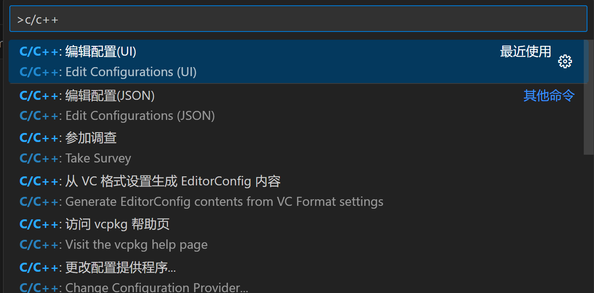
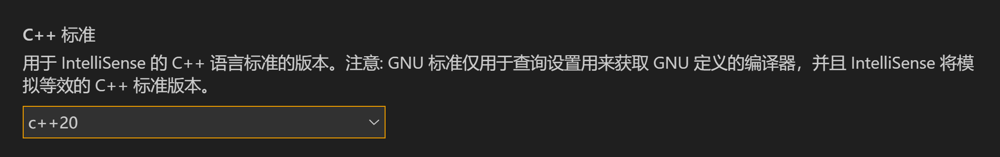
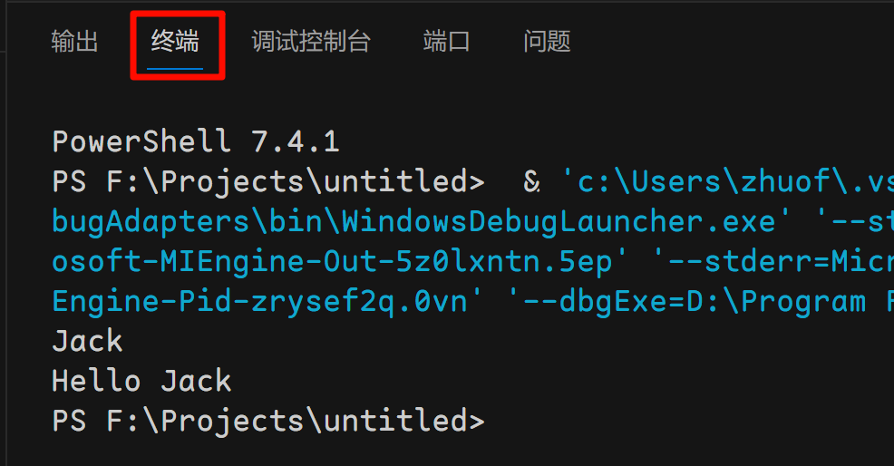

# 无构建工具使用 VSCode

我们课程不推荐无构建工具地使用 VSCode，因为配置起来比较麻烦。但是，不使用构建工具，意味着不需要每写一个包含`main`函数的源文件，就必须创建一个单独的项目。这也许会给写 oj 上的作业带来一点方便。

你可以使用[谷雨学长提供的工具](https://vscch.guyutongxue.site/)来自动配置，也可以使用下面的方式来手动配置。

## 单文件情况

你可以随意创造一个文件，随便写点代码，发现点右上角的`▶`符号并不能进行编译。此时你需要在项目根目录创建`.vscode`子文件夹，并加入 tasks.json 和 launch.json。

- Windows 如果使用 MSVC 编译器（不推荐），则在.vscode 文件夹中新建 tasks.json 中填写以下内容：

  > 这本质上就是在指定命令行参数，因此你需要在 x64 native terminal 中`cd 工作目录`，再用`code .`来用 VSCode 打开文件夹，来使 msvc 正常工作。
  >
  > 每次使用 vscode 都需要这样打开，过于麻烦，所以不推荐 vscode 在无构建工具使用 msvc。

  ```json
  {
    "version": "2.0.0",
    "tasks": [
      {
        "label": "create build dir",
        "type": "shell",
        "command": "cmd",
        "args": ["/C", "if not exist .\\build mkdir .\\build"]
      },
      {
        "type": "shell",
        "label": "C/C++: cl.exe build active file",
        "command": "cl.exe",
        "args": [
          "/std:c++20",
          "/Zi",
          "/EHsc",
          "/Fe:",
          "${fileDirname}\\build\\${fileBasenameNoExtension}.exe",
          "/Fo:",
          "${fileDirname}\\build\\${fileBasenameNoExtension}.obj",
          "/Fd:",
          "${fileDirname}\\build\\${fileBasenameNoExtension}.pdb",
          "${file}"
        ],
        "problemMatcher": ["$msCompile"],
        "group": {
          "kind": "build",
          "isDefault": true
        },
        "dependsOn": ["create build dir"]
      }
    ]
  }
  ```

  然后在.vscode 文件夹中创建 launch.json 文件并加入以下内容（你可以把`//`表示的注释去掉）：

  ```json
  {
    "version": "0.2.0",
    "configurations": [
      {
        "name": "C/C++: cl.exe generate and debug active file",
        // type 告诉 vscode 编译器任务的类型
        // 这个是规定的，不是随便写，比如 msvc 编译器就是 cppvsdbg
        "type": "cppvsdbg",
        "request": "launch", //有 launch 和 attach 可选，这里填 launch，按下 F5 就可以启动调试了；而不是 attach（附加）
        // program 这个是你的可执行程序位置，这里可以根据自己的 tasks.json 生成
        // 程序的位置自定义修改，等会参照后面的 tasks.json 内容
        //程序所在路径和程序名
        "program": "${fileDirname}\\build\\${fileBasenameNoExtension}.exe",
        //这里填命令行参数（main 函数的形参）
        "args": [],
        //为 true 时，在开始运行程序时，不立刻往后执行，先暂停一下，一般填 false；
        "stopAtEntry": false,
        //目标工作目录，在哪个目录调试程序，一般在当前文件夹（项目所在文件夹）；
        "cwd": "${fileDirname}",
        //临时手动添加环境变量；
        "environment": [],
        //使用内置终端运行程序，支持输入
        "console": "integratedTerminal",
        //这个表示 执行调试前 要完成的任务 该值需要与 tasks.json 中的 label 相同，否则调试时会提示找不到；
        "preLaunchTask": "C/C++: cl.exe build active file"
      }
    ]
  }
  ```

- 如果你使用 GCC/Clang，可以在.vscode 文件夹中添加 tasks.json 文件并添加以下内容，然后根据需要修改其中的 command 路径：

  ```json
  {
    "version": "2.0.0",
    "tasks": [
      {
        "label": "create build dir",
        "type": "shell",
        "command": "mkdir -p ./build",
        "windows": {
          "command": "cmd",
          "args": ["/C", "if not exist .\\build mkdir .\\build"]
        }
      },
      {
        "type": "shell",
        "label": "C/C++: c++ build active file",
        // 你的g++或clang++路径
        // 如果你使用的是由MSYS2安装的GCC，那么路径可能是C:\msys64\ucrt64\bin\g++.exe
        "command": "g++",
        "args": [
          "-fdiagnostics-color=always",
          "-Wall",
          "-std=c++20",
          "-o",
          "${fileDirname}/build/${fileBasenameNoExtension}",
          "${file}"
        ],
        "problemMatcher": ["$gcc"],
        "group": {
          "kind": "build",
          "isDefault": true
        },
        "dependsOn": ["create build dir"]
      }
    ]
  }
  ```

  然后在.vscode 文件夹中创建 launch.json 并添加以下内容：

  ```json
  {
    "version": "0.2.0",
    "configurations": [
      {
        "name": "C/C++: c++ generate and debug active file",
        // type 告诉 vscode 编译器任务的类型，这里是 cppdgb，不能随意修改
        "type": "cppdbg",
        "request": "launch", //有 launch 和 attach 可选，这里填 launch，按下 F5 就可以启动调试了；而不是 attach（附加）
        // program 这个是你的可执行程序位置，这里可以根据自己的 tasks.json 生成
        // 程序的位置自定义修改
        "program": "${fileDirname}/build/${fileBasenameNoExtension}",
        "windows": {
          "program": "${fileDirname}/build/${fileBasenameNoExtension}.exe"
        },
        //这里填命令行参数（main 函数的形参）
        "args": [],
        //为 true 时，在开始运行程序时，不立刻往后执行，先暂停一下，一般填 false；
        "stopAtEntry": false,
        //目标工作目录，在哪个目录调试程序，一般在当前文件夹（项目所在文件夹）；
        "cwd": "${fileDirname}",
        //是否在外部控制台运行程序。如果为 false，则使用 vscode 的控制台运行程序。
        "externalConsole": false,
        //这个表示 执行调试前 要完成的任务 该值需要与 tasks.json 中的 label 相同，否则调试时会提示找不到；
        "preLaunchTask": "C/C++: c++ build active file"
      }
    ]
  }
  ```

最后，需要配置 Microsoft C/C++ Extension；使用`ctrl-shift-p`（Mac 下为`command-shift-p`）打开 vscode 命令面板，搜索`c/c++`，进入`C/C++：编辑配置（UI）`，并将其中的 C++ 标准改为 C++20。





然后，打开你需要编译运行的文件，然后点击**F5**，就可以编译、运行并调试该程序了。

运行之后会自动打开终端。但有时候会自动跳转到“**调试控制台**”，只需要在 vscode 页面的下方切换到“**终端**”选项卡，就能看到程序的输出，以及执行输入了。



## 多文件情况（特别不推荐）

如果你需要多个文件共同编译为一个目标，那么`tasks.json`中的`arguments`就不正确了；我们可以注意到最后一个参数是`${file}`，即当前文件；如果我们需要批量的文件，可以改为例如`${fileDirname}/*.cpp`来匹配当前文件夹下所有的 cpp 共同生成一个文件。
